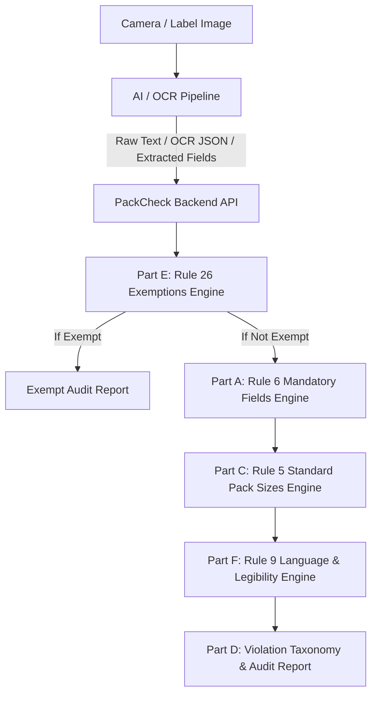

# PackCheck Legal Metrology Backend Specification

**SIH 2026 Problem Statement SIH26034**  
**Legal Metrology (Packaged Commodities) Rules, 2011 (GSR 202(E))**  
*Internal Build Specification & OCR Platform Integration Guide*

---

## 1. System Architecture



---

## 2. Statutory Rule Mapping

### Part E — Exemptions (Rule 26) [Evaluated First]
1. **Very small packages**: $\le 10\text{g}$ or $\le 10\text{ml}$ — Fully exempt from Chapter II.
2. **Small packages (partial)**: $10\text{g}-20\text{g}$ or $10\text{ml}-20\text{ml}$ — Exempt from manufacturer, packing date, and consumer care; **MRP and Net Quantity remain mandatory**.
3. **Fast food**: Packed directly by hotels/restaurants for immediate sale — Fully exempt.
4. **Scheduled drugs**: Governed by the Drugs (Price Control) Order (DPCO) — Fully exempt.
5. **Large agricultural produce**: Packages $> 50\text{kg}$ — Fully exempt.

### Part A — The 7 Mandatory Declaration Fields (Rule 6)
- **Rule 6(1)(a) — Manufacturer / Packer / Importer**: Complete name and address (locality/pin code). Flags *"Marketed by only, no Manufactured by"* as a distinct `FORMAT_ERROR`.
- **Rule 6(1)(b) — Generic / Common Commodity Name**: Plain everyday category descriptor distinct from brand name.
- **Rule 6(1)(c) — Net Quantity**: Standard metric units (`g, kg, ml, l, count`). Flags banned qualifiers (`approx`, `minimum`, `about`, `nearly`, `+/-`) as `VAGUE_LANGUAGE` and banned units (`dozen`) as `UNIT_ERROR`.
- **Rule 6(1)(d) — Month & Year of Manufacture/Packing**: Month + year format. Bidis, incense sticks (agarbatti), and LPG cylinders are legally exempt.
- **Rule 6(1)(e) — Retail Sale Price (MRP)**: Maximum retail price explicitly stating `"inclusive of all taxes"`. Missing tax phrase with price present is classified as `FORMAT_ERROR` (not `MISSING`).
- **Rule 6(1)(f) — Dimensions**: Conditional field for size-relevant goods (bedsheets, towels, cloth, tiles). Food/FMCG is marked `NOT_APPLICABLE`.
- **Rule 6(2) — Consumer Care Details**: Toll-free helpline, 10-digit number, support email, or grievance address.

### Part B — Numeral Height (Rule 7 & 8)
- **SKIPPED** per Team Decision due to real-world mm scale ambiguity without a flat reference coin. Documented as out of scope (`SIZE_ERROR`).

### Part C — Standard Pack Sizes (Rule 5 & Second Schedule)
- Regulated lookup table for **Tea, Biscuits, Salt, Cement, Toilet Soap, Aerated Drinks**.
- Non-standard pack size without `"Non-standard size"` disclaimer $\to$ `NONSTANDARD_PACK`.

### Part F — Language & Legibility (Rule 9)
- Mandatory declarations in **Hindi (Devanagari)** or **English (Latin)**. Regional languages may accompany but cannot replace these.
- OCR confidence score below threshold ($< 0.60$) $\to$ `LOW_CONFIDENCE`.

---

## 3. REST API Endpoints

### Base URL: `http://localhost:5000/api`

| Method | Endpoint | Description |
| :--- | :--- | :--- |
| `GET` | `/health` | Health status and engine metadata |
| `POST` | `/compliance/check-text` | Check raw OCR text from camera / image scan |
| `POST` | `/compliance/check-fields` | Check structured / pre-extracted dictionary |
| `POST` | `/compliance/check-ocr` | Check full OCR platform JSON (tokens, boxes, confidences) |
| `GET` | `/compliance/standard-sizes` | Get statutory standard pack sizes table |
| `GET` | `/compliance/exemptions` | Get statutory Rule 26 exemption categories |
| `GET` | `/compliance/rules` | Get statutory rule references and descriptions |

---

## 4. How to Connect to OCR Platforms

### Method 1: Python Direct Call (Zero Network Overhead)
```python
from ocr import PackageFieldExtractor
from compliance import ComplianceEngine

# 1. Feed OCR output text
extractor = PackageFieldExtractor()
fields = extractor.extract_from_text(raw_ocr_string, confidence=0.95)

# 2. Audit compliance
engine = ComplianceEngine()
report = engine.evaluate(fields, commodity_category="tea")

print("Compliant:", report.is_compliant)
print("Violations:", report.violation_summary)
```

### Method 2: HTTP JSON API
```bash
curl -X POST http://localhost:5000/api/compliance/check-text \
  -H "Content-Type: application/json" \
  -d '{
    "text": "Zoomo Blast Carbonated Fruit Drink Net Vol 250ml MRP Rs 35.00 (Inclusive of all taxes) Mfg 03/2026 Manufactured by XYZ Foods Pvt Ltd, Surat - 395001 Care: care@zoomoblast.com",
    "commodity_category": "aerated_drinks",
    "confidence": 0.96
  }'
```

### Method 3: Cloud Vision / AWS Textract / Tesseract Payloads
```python
from ocr.adapters import CloudVisionAdapter, TesseractAdapter
from ocr import PackageFieldExtractor
from compliance import ComplianceEngine

# Adapt Cloud Vision response
adapter = CloudVisionAdapter()
ocr_result = adapter.extract_text(vision_api_response_json)

extractor = PackageFieldExtractor()
fields = extractor.extract_from_ocr_result(ocr_result)

engine = ComplianceEngine()
report = engine.evaluate(fields)
```

---

## 5. Running the Backend & Tests

```bash
# Install dependencies
pip install -r requirements.txt

# Run all 29 automated tests
python -m unittest discover -s tests

# Run the live interactive demo
python demo_ocr_pipeline.py

# Start the REST API server
python backend/app.py
```
